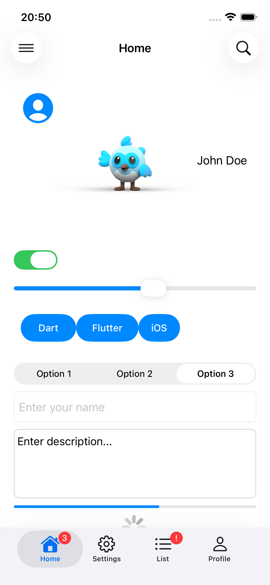
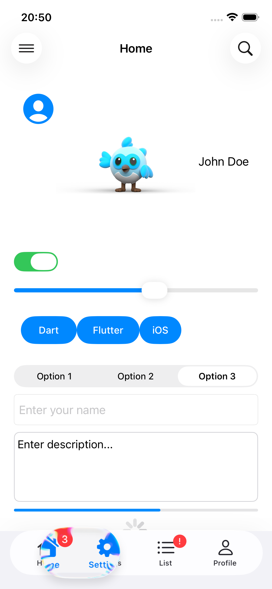
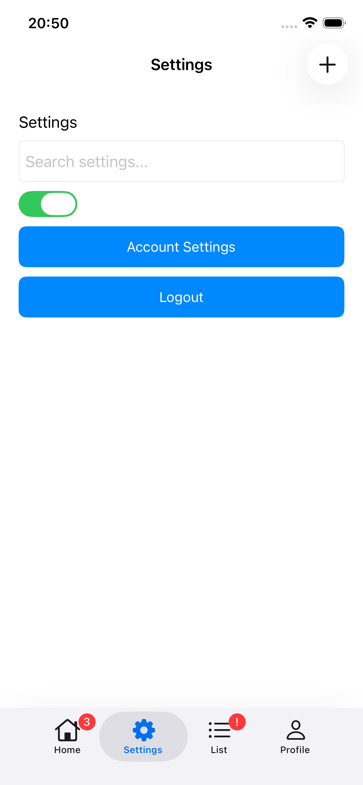
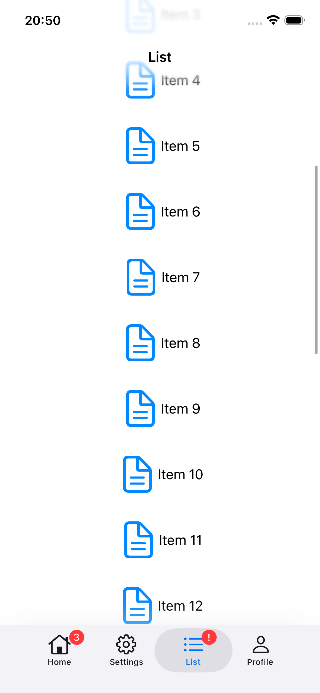

# Hello World Flutter Zero

A simple “Hello World” Flutter project based on **Flutter Zero** — a minimal Flutter runtime without built-in UI toolkits. This repository demonstrates how to create and run a basic Flutter application using the Flutter Zero setup from the **flutter_zero** project.

## 🧠 What is Flutter Zero?

**Flutter Zero** is a stripped-down version of the Flutter engine that deliberately omits the UI layer (no Skia, no Impeller, no `dart:ui`). It provides a lean Dart runtime compatible with Flutter tooling, enabling experimentation with custom UI layers or alternative renderers while still using the familiar Flutter toolchain.

This project builds on that concept and shows the simplest possible Flutter Zero app — a “Hello World.”

---

## 📸 Screenshots & Demo

> Output of the Hello World app running on Flutter Zero.

### Screenshots

| | |
|:---:|:---:|
|  |  |
|  |  |

### Demo Video

<video src="screens/demo.webm" width="320" height="640" controls></video>

Video doesn't work on github. You can find it here: https://github.com/charafau/hello_world_flutter_zero/blob/main/screens/demo.webm/


---

## 🚀 Features

- Minimal Flutter Zero application
- Cross-platform support (Android, iOS, web, desktop)
- Works with existing Flutter tooling
- Ideal starting point for custom UI or rendering experiments

---

## 📦 Requirements

Before running this project, ensure you have:

- [Flutter Zero from Matej Knopp](https://github.com/knopp/flutter_zero/tree/master)
- Dependencies provided by the upstream **flutter_zero** project

---

## 🛠 Setup & Installation

1. **Clone the repository**

   ```bash
   git clone https://github.com/charafau/hello_world_flutter_zero.git
   cd hello_world_flutter_zero
   
2. Launch ios simulator

3.  Run app (with Flutter Zero)
   ```bash
   flutter run 
